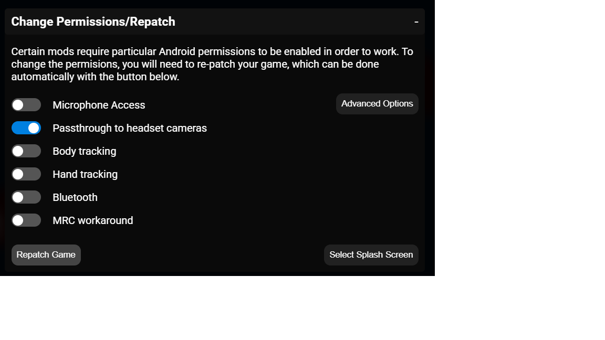

# Transparency

See EVERYTHING (When playing Beat Saber) - Allows you to use the passthrough camera feed as the environment.

Targets Beat Saber Quest `1.40.6_6407`. (Should work with other versions?)

Before launching Beat Saber, enable the MBF permission for passthrough headset cameras and repatch the game. The effect is controlled by the `Transparency` toggle in the gameplay setup menu, use the sliders there to adjust it to whatever you would like

## Credits

* [zoller27osu](https://github.com/zoller27osu), [Sc2ad](https://github.com/Sc2ad) and [jakibaki](https://github.com/jakibaki) - [beatsaber-hook](https://github.com/sc2ad/beatsaber-hook)
* [raftario](https://github.com/raftario)
* [Lauriethefish](https://github.com/Lauriethefish), [danrouse](https://github.com/danrouse) and [Bobby Shmurner](https://github.com/BobbyShmurner) for [this template](https://github.com/Lauriethefish/quest-mod-template)
